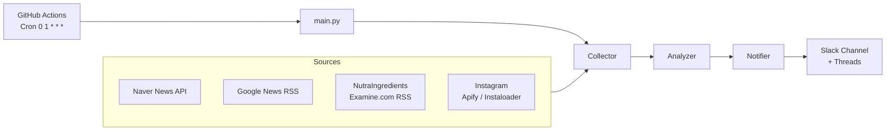

# Design Document

## Overview

'모아담다' 건강기능식품 브랜드를 위한 일일 뉴스 요약 슬랙 봇.
GitHub Actions Cron(UTC 01:00 = KST 10:00)으로 매일 자동 실행되며, 국내외 뉴스·RSS·SNS 소스에서 건기식 관련 Article을 수집하고, GPT-4o로 관련성 판단 및 한국어 요약 후, slack_sdk로 스레드 형태로 발송한다.

파이프라인은 단방향 순차 구조: **Collector → Analyzer → Notifier**



## Architecture

### 모듈 구조

```
daily-health-news-slack-bot/
├── main.py                    # 진입점: 파이프라인 오케스트레이션
├── collector.py               # 다중 소스 수집 모듈
├── analyzer.py                # GPT-4o 관련성 판단 및 요약 모듈
├── notifier.py                # Slack 메시지 발송 모듈
├── models.py                  # 공유 데이터 모델 (dataclass)
├── requirements.txt           # Python 의존성
└── .github/
    └── workflows/
        └── main.yml           # GitHub Actions workflow
```

### 실행 흐름

1. `main.py`가 환경 변수 유효성 검사 후 파이프라인 시작
2. `Collector`가 4개 소스에서 병렬/순차 수집 (소스 실패 시 skip)
3. `Analyzer`가 수집된 Article 목록을 GPT-4o에 전달, 필터링 + 요약 반환
4. `Notifier`가 본문 메시지 발송 후 각 Article을 스레드로 발송

### 의존성

```
openai>=1.0.0
slack_sdk>=3.0.0
feedparser>=6.0.0
requests>=2.28.0
apify-client>=1.0.0
python-dotenv>=1.0.0
```

## Components and Interfaces

### Collector (`collector.py`)

```python
def collect_all() -> list[Article]:
    """모든 소스에서 Article 수집. 실패 소스는 skip하고 로그 기록."""
```

내부 함수:
- `collect_naver(query: str) -> list[Article]` — Naver News API, 검색어 3개
- `collect_google_rss(query: str) -> list[Article]` — Google News RSS
- `collect_foreign_rss(feed_urls: list[str]) -> list[Article]` — feedparser
- `collect_instagram(accounts: list[str]) -> list[Article]` — Apify 또는 Instaloader

각 수집 함수는 실패 시 빈 리스트를 반환하고 오류를 로그에 기록한다.

### Analyzer (`analyzer.py`)

```python
def analyze(articles: list[Article]) -> list[SummarizedArticle]:
    """GPT-4o로 관련성 판단 및 요약. 실패 시 예외 발생."""
```

- 시스템 프롬프트 상수 `SYSTEM_PROMPT` 정의
- Article 목록을 JSON 직렬화하여 GPT-4o에 전달
- 응답을 파싱하여 `SummarizedArticle` 목록 반환
- API 실패 시 예외를 상위로 전파 (Notifier 실행 중단)

### Notifier (`notifier.py`)

```python
def notify(summaries: list[SummarizedArticle]) -> None:
    """Slack 채널에 본문 메시지 + 스레드 발송."""
```

- `chat.postMessage`로 `[M/D 건기식 뉴스 봇]` 본문 발송
- 반환된 `ts`로 각 SummarizedArticle을 스레드에 발송
- 결과 0건이면 "오늘은 주목할 만한 건기식 뉴스가 없습니다." 발송
- API 실패 시 로그 기록 후 종료

### main.py

```python
def main():
    validate_env()          # 필수 환경 변수 검사
    articles = collect_all()
    summaries = analyze(articles)
    notify(summaries)
```

## Data Models

```python
from dataclasses import dataclass
from typing import Optional

@dataclass
class Article:
    title: str
    url: str
    content: str          # 본문 또는 요약 텍스트
    source: str           # 'naver', 'google_rss', 'foreign_rss', 'instagram'
    published_at: Optional[str] = None  # ISO 8601 또는 원본 문자열

@dataclass
class SummarizedArticle:
    keyword_source: str   # "[키워드/출처]"
    headline: str         # 핵심 요약 제목
    summary: str          # 3줄 이내 본문 요약
    url: str              # 원문 URL
```

### 환경 변수 목록

| 변수명 | 용도 |
|---|---|
| `OPENAI_API_KEY` | GPT-4o API 인증 |
| `SLACK_BOT_TOKEN` | Slack Bot OAuth 토큰 |
| `SLACK_CHANNEL_ID` | 발송 대상 채널 ID |
| `NAVER_CLIENT_ID` | Naver 검색 API Client ID |
| `NAVER_CLIENT_SECRET` | Naver 검색 API Secret |
| `APIFY_API_KEY` | Apify Instagram 스크래핑 (선택) |


## Correctness Properties

*A property is a characteristic or behavior that should hold true across all valid executions of a system — essentially, a formal statement about what the system should do. Properties serve as the bridge between human-readable specifications and machine-verifiable correctness guarantees.*

### Property 1: 48시간 필터링 일관성

*For any* 소스(Naver, Google RSS, 해외 RSS)에서 수집된 Article 목록에 대해, 반환된 모든 Article의 `published_at`은 현재 시각 기준 48시간 이내여야 한다.

**Validates: Requirements 2.1, 2.2, 2.3**

### Property 2: 소스 실패 시 부분 수집 보장

*For any* 소스 집합에서 일부 소스가 예외를 발생시킬 때, `collect_all()`은 성공한 소스의 Article을 포함한 목록을 반환해야 하며, 실패한 소스 정보가 로그에 기록되어야 한다.

**Validates: Requirements 2.5, 2.6**

### Property 3: LLM 응답 파싱 결과 구조 완전성

*For any* GPT-4o 응답에서 파싱된 `SummarizedArticle` 목록에 대해, 각 항목은 `keyword_source`, `headline`, `summary`, `url` 필드를 모두 포함해야 한다.

**Validates: Requirements 3.3, 3.6**

### Property 4: 본문 메시지 날짜 형식

*For any* 실행 날짜에 대해, Notifier가 생성하는 본문 메시지 텍스트는 `[M/D 건기식 뉴스 봇]` 패턴(예: `[10/24 건기식 뉴스 봇]`)을 만족해야 한다.

**Validates: Requirements 4.2**

### Property 5: 스레드 메시지 형식 완전성

*For any* `SummarizedArticle` 목록에 대해, 각 스레드 메시지는 `keyword_source`, `headline`, `summary`, `url`을 모두 포함하는 형식으로 구성되어야 한다.

**Validates: Requirements 4.3, 4.4**

### Property 6: 필수 환경 변수 누락 시 즉시 종료

*For any* 필수 환경 변수 집합의 부분 집합이 누락된 경우, `validate_env()`는 예외 또는 SystemExit을 발생시켜야 하며, 파이프라인이 실행되지 않아야 한다.

**Validates: Requirements 5.3**

## Error Handling

| 상황 | 처리 방식 |
|---|---|
| 개별 소스 수집 실패 | 해당 소스 skip, 오류 로그 기록, 나머지 소스 계속 수집 |
| LLM API 호출 실패 | 예외 로그 기록 후 프로세스 종료 (Notifier 미실행) |
| Slack API 호출 실패 | 오류 로그 기록 후 재시도 없이 종료 |
| 필수 환경 변수 누락 | 명확한 오류 메시지 출력 후 즉시 종료 |
| 수집 결과 0건 | 정상 흐름으로 처리, Notifier가 "뉴스 없음" 메시지 발송 |

오류 로깅은 Python 표준 `logging` 모듈을 사용하며, GitHub Actions 로그에서 확인 가능하도록 stdout/stderr로 출력한다.

## Testing Strategy

### 이중 테스트 접근법

단위 테스트와 속성 기반 테스트를 함께 사용하여 포괄적인 검증을 수행한다.

- **단위 테스트**: 특정 예시, 엣지 케이스, 오류 조건 검증
- **속성 기반 테스트**: 임의 입력에 대한 보편적 속성 검증

### 속성 기반 테스트 설정

- 라이브러리: **Hypothesis** (Python 속성 기반 테스트 표준 라이브러리)
- 최소 반복 횟수: 각 속성 테스트당 **100회 이상**
- 각 테스트에 태그 주석 포함

태그 형식: `# Feature: daily-health-news-slack-bot, Property {번호}: {속성 설명}`

### 단위 테스트 대상

- `validate_env()`: 필수 변수 누락 시 SystemExit 발생 (Requirements 5.3)
- `collect_naver()` / `collect_google_rss()` 등: mock HTTP 응답으로 파싱 검증
- `analyze()`: mock OpenAI 응답으로 파싱 및 예외 처리 검증 (Requirements 3.5)
- `notify()`: mock Slack 클라이언트로 호출 순서 및 인자 검증 (Requirements 4.1, 4.5, 4.6)
- 파이프라인 순서: `main()` mock으로 Collector → Analyzer → Notifier 순서 검증 (Requirements 1.2, 6.4)
- workflow 파일 구조: YAML 파싱으로 cron 표현식 및 env 블록 검증 (Requirements 1.1, 5.2)

### 속성 기반 테스트 대상

각 Correctness Property에 대해 단일 속성 기반 테스트를 구현한다:

| 테스트 | 대상 Property | Hypothesis 전략 |
|---|---|---|
| 48시간 필터링 | Property 1 | `st.datetimes()` 로 임의 날짜 생성 |
| 소스 실패 부분 수집 | Property 2 | `st.lists()` + 임의 예외 발생 소스 조합 |
| LLM 응답 파싱 구조 | Property 3 | `st.fixed_dictionaries()` 로 임의 응답 생성 |
| 본문 메시지 날짜 형식 | Property 4 | `st.dates()` 로 임의 날짜 생성 |
| 스레드 메시지 형식 | Property 5 | `st.builds(SummarizedArticle, ...)` |
| 환경 변수 누락 종료 | Property 6 | `st.sets()` 로 임의 누락 변수 조합 |
